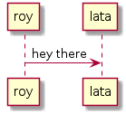

= Sample diagram
:icons: font

:heading-title: long heading \
that I would like to \
span over multiple lines \
in the .adoc file

:stylesheet: Your_Chosen_Stylesheet.css

++++

++++

:mylink: http://www.apache.org/licenses/LICENSE-2.0

[frame=none]
|===
|Col1 | Col2

a|
plantuml diagram

a|include::snippets.adoc[tag=joe]

a|include::snippets.adoc[tag=jane]

a|graphviz diagram
[graphviz, images/graphviz_test_1, svg]
[link="{mylink}", width="240"]
....
digraph test {
  rankdir="LR"
  bgcolor="transparent"
  size="1.5"
  A -> e
  B -> C
  C -> D
}
....

|link to lata article
|icon:book[link="articles/lata.html"]
|link to sara article
|icon:book[link="articles/sara.html"]
|link to michelle article
|icon:book[link="articles/michelle.html"]

|===

